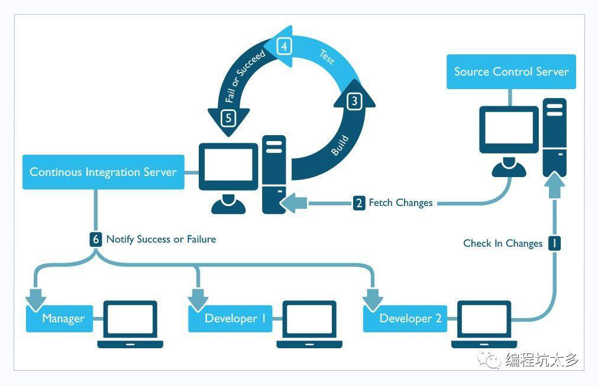

# Git

Git是一个开源的分布式版本控制系统，可以有效、高速的处理从很小到非常大的项目版本管理。Git 是 Linus Torvalds 为了帮助管理 Linux 内核开发而开发的一个开放源码的版本控制软件。



[GitHub官网注册](#https://github.com/)

Git客户端安装：`yum install –y git`

文章目录：

1. [常用命令](#常用命令)
2. [忽略文件](#忽略文件)
3. [下载速度](#下载速度)

## 常用命令

```sh
# 1. 初始化git项目
git init
# 2. 查看当前项目状态
git status
# 3. 新建文件并再次查看状态
echo "# My Project" > README.md
git status
# 4. 记录当前操作，记录新加入的文件并再次查看状态
git add README.md
git status
# 5. 记录当前更改并加以信息描述
git commit 文件名 -m'add my first project'
# 6. 查看提交历史
git log
# 7. 新建远程仓库
git remote add origin https://github.com/limingios/git-test.git
# 8. 同步到远程仓库
git push -u origin master
# 9. 从远程代码库同步到本地
git pull origin master
# 10. 与同步前对比变更
git diff HEAD
# 11. 查看当前更改变更
git diff –staged
# 12. 恢复到未更改状态
git reset README.md
# 13. 覆盖本地文件
git checkout octocat.txt
# 14. 冲突处理
简单的冲突直接手工编辑，复杂的冲突可以借助工具解决。下面的命令会自动找到本机上的合并工具：
git mergetool
# ------------------------------------------------------------


# 全局变量
# ------------------------------------------------------------
# 示例：设置用户名和邮箱
git config --global user.name "Colin Chen"
git config --global user.email "colin.chen@softtek.com"
# 查看设置的变量：
git config --list --global
# ------------------------------------------------------------


# 远程版本库
# ------------------------------------------------------------
# 查看关联的远程版本库
git remote -v
# 查看某个远程版本库详情
git remote show <name>
# 给远程版本库添加别名
git remote add <alias> git://xxx/xxx.git
# ------------------------------------------------------------


# 分支相关命令
# ------------------------------------------------------------
# 拉取服务器新的分支
git pull origin <branch>:<branch>
# 新建分支
git branch feature1 # 或者
git checkout -b feature1
# 推送到远程新分支
git push --set-upstream origin <feature1>
# 推送到远程仓库
git push origin feature1
# 切换分支
git checkout feature1
# 设置上游分支
git branch --set-upstream-to=origin/<feature1> <feature1>
# 查看上下游分支关系
git branch -vv

# 合并分支
# 1、直接合并
git checkout master
git merge feature1
# 2、压力合并：将一条分支上的所有历史提交压合成一条提交
git checkout -b feature1 master
...
git checkout master
git merge --squash feature1
# 此时提交还在暂存区中，查看状态
git status
# 提交
git commit
# 3、拣选合并
# 加了参数-n后，不会在主分支立即提交，会等待下一个文件的合并
git cherry-pick -n <fileId>

# 查看当前库中有哪些分支
git branch -a

# 删除本地已经合并了的分支
git branch -d 分支名
# 删除本地未合并的分支
git branch -D 分支名
# 删除服务器远端的分支
git push origin --delete 分支名
# -d,--delete


# 恢复历史版本
# ------------------------------------------------------------
# 1. 暴力方式
# 备份当前的分支到 backup_commit
git tag backup_commit
git push origin backup_commit
# 重置 source 分支
git reset --hard 23801b2
# 强制 push 更新远程分支
git push origin source -f

# 2. 温和方式
# 将代码切换到目标提交的id
git reset --hard 23801b2
# 将当前代码切换回最新的提交
git reset --soft origin/source
# 执行完上面两步后，你的仓库还是最新的提交，但是工作区变成了历史的提交内容
# 这个时候用 git add 和 git commit 即可。
# 该方法需要保证 reset 的时候没有别人做新的提交，如果有的话，会把别人的提交也一并撤销了。
# 所以还是挺危险的，慎用。
# ------------------------------------------------------------
```


## 忽略文件

**1. 使用 `.gitignore` 文件**

- 在项目目下创建.gitignore文件。
- 在.gitignore文件中添加忽略内容。eg：
  
  ```sh
  /node_modules/
  /dist/
  *.zip     # 忽略所有.zip结尾的文件
  *.a       # 忽略所有 .a 结尾的文件
  !lib.a    # 但 lib.a 除外
  ```

（需要注意的是，.gitignore文件本身是会加入到版本控制当中的。也就是说有机会会影响到同时开发该项目的同事的提交）

用户目录下创建 ~/.gitignore_global 文件

```sh
# 执行命令使配置生效
git config --global core.excludesfile ~/.gitignore_global
# 查看文件是否忽略成功
git status
# 如果已经commit了，再加入gitignore是无效的，所以需要删除下缓存
git rm -r --cached ignore_file
```

注意：.gitignore只能忽略那些原来没有被track的文件，如果某些文件已经被纳入了版本管理中，则修改.gitignore是无效的。

正确的做法是在每个clone下来的仓库中手动设置不要检查特定文件的更改情况。在PATH处输入要忽略的文件。

```sh
git update-index --assume-unchanged <PATH> 
```

**2. 使用 `.git/info/exclude` 文件**

在exclude文件中添加需要忽略的内容，具体的忽略规则与.gitignore文件中的差不多。

但是，需要注意的是，.gitignore是会被提交到远程仓库的，会影响到他人的提交，所以，.gitignore中忽略的内容应该是公司共同需要忽略的东西。而exclude文件不会加入到版本控制中、不会提交到远程仓库，因此不会影响到他人的提交。可以是用exclude来忽略到自己本地项目中的一些文件。


## 下载速度

**1. 代理**

1、打开本机host文件

2、利用[网站](https://www.ipaddress.com/)查询IP：github.com, github.global.ssl.fastly.net

3、配置在host中

```sh
140.82.112.3 github.com
199.232.69.194 github.global.ssl.fastly.net
```

同时将DNS信息配置到Git安装目录下的hosts文件中（未验证）

4、刷新 DNS 缓存：`ipconfig /flushdns`，OK!

**2. git shallow clone**

```sh
git clone https://github.com/xxx --depth 1
cd xxx
git fetch --unshallow
```

解释一下这两条命令:

`git clone --depth 1` 本身会让clone下来的是最近的一个commit的文件夹状态，而不是整个文件夹的记录

然后`git fetch --unshallow`可以在之后，将整个文件夹的状态下载下来

**3. 使用github cnpmjs镜像**

将本来的`git clone https://github.com/xxx.git` 改成：`git clone https://github.com.cnpmjs.org/xxx.git`

**4. 使用码云**

[码云](https://link.zhihu.com/?target=https%3A//gitee.com)本身支持直接从github一键导入repo，然后直接从码云上clone就会非常方便


**git push一直停留在writing objects，速度慢**

```sh
git config --global http.postBuffer 5242880000
```

作用：因为 `http.postBuffer` 默认上限为1M，上面的命令是把 git 的配置里 http.postBuffer 的变量改大为500M，文件大、上传慢

```sh
git config --global http.lowSpeedLimit 0
git config --global http.lowSpeedTime 999999
```

使用 git 更新或提交中途有时出现 `The remote end hung up unexpectedly` 的异常，特别是资源库在国外的情况下。此问题可能由网络原因引起。配置 git 的最低速度和最低速度时间：

```sh
git config --global pack.windowMemory 1024m
```

`fatal: Out of memory, malloc failed` 问题的解决

```sh
git push <远程主机名> <本地分支名>:<远程分支名>
git push origin master:master
git branch --set-upstream-to=origin/dev master
```

`git push origin` 与 `git push -u origin master` 的区别

`git push origin` 命令表示，将当前分支推送到 origin 主机的对应分支。如果当前分支只有一个追踪分支，那么主机名都可以省略。

`git push` 如果当前分支与多个主机存在追踪关系，那么这个时候 `-u` 选项会指定一个默认主机，

这样后面就可以不加任何参数使用 `git push`。

`git push -u origin master` 命令将本地的 master 分支推送到 origin 主机，同时指定 origin 为默认主机，

后面就可以不加任何参数使用 `git push` 了。 不带任何参数的 `git push`，默认只推送当前分支，这叫做 simple 方式。

此外，还有一种 matching 方式，会推送所有有对应的远程分支的本地分支。
Git 2.0版本之前，默认采用 matching 方法，现在改为默认采用 simple 方式。


[Windows下配置Git服务器和客户端 超全](https://www.cnblogs.com/webenh/p/5864007.html)

官网：[https://git-scm.com/](https://git-scm.com/)


## 常用命令

```sh
--help # 帮助查询

git checkout 分支名  # 切换本地分支
'''
参数：-b: 新建并切换
'''

git push origin HEAD:nsdl-3.0 # 推送到远端特定分支nsdl-3.0
git push origin HEAD:refs/for/nsdl-3.0 # 推送到远端nsdl-3.0分支的临时分支中
git push -f origin HEAD:master # 强制推送掉远端Master分支（先要取消保护）
'''  
refs/for 的意义在于推送代码经过code review后才merge到nsdl-3.0分支中，而refs/heads不需要
'''
```

## 常见问题

刚配置好的git仓库服务器，首次提交的时候会报如下错误：


这是由于git默认拒绝了push操作，需要进行设置，修改.git/config添加如下代码：

```ini
[receive]
denyCurrentBranch = ignore
```

github上传时出现 `error: src refspec master does not match any` 解决办法

引起该错误的原因是，目录中没有文件，空目录是不能提交的

如果系统中有一些配置文件在服务器上做了配置修改，然后后续开发又新添加一些配置项的时候，在发布这个配置文件的时候，会发生代码冲突：

```shell
error: Your local changes to the following files would be overwritten by merge:
  protected/config/main.php
  Please, commit your changes or stash them before you can merge.
```

如果希望保留生产服务器上所做的改动，仅仅并入新配置项，处理方法如下：

```sh
git stash
git pull
git stash pop
```

然后可以使用 `git diff -w +文件名` 来确认代码自动合并的情况。

反过来，如果希望用代码库中的文件完全覆盖本地工作版本。方法如下：

```sh
git reset --hard
git pull
```

其中 `git reset` 是针对版本，如果想针对文件回退本地修改，使用

```sh
git checkout HEAD file/to/restore
```

git提交时报错：`Updates were rejected because the tip of your current branch is behind...`

出现这样的问题是由于：自己当前版本低于远程仓库版本，有如下几种解决方法：

1. 使用强制push的方法：`git push -u origin master -f`  
   这样会使远程修改丢失，一般是不可取的，尤其是多人协作开发的时候。

2. push前先将远程repository修改pull下来

   ```sh
   git pull origin master
   git push -u origin master
   ```

3. 若不想merge远程和本地修改，可以先创建新的分支：

   `git branch [name]`

   然后push

   `git push -u origin [name]`

***恢复历史版本***

```sh
# 查询commit_id
git log
git reset commit_id 文件路径
git checkout -- 文件路径
```

## Git&nbsp;hook配置

Git也具有在特定事件发生之前或之后执行特定脚本代码功能（从概念上类比，就与监听事件、触发器之类的东西类似）。Git Hooks就是那些在Git执行特定事件（如commit、push、receive等）后触发运行的脚本。

按照Git Hooks脚本所在的位置可以分为两类：

1. 本地Hooks，触发事件如commit、merge等。
2. 服务端Hooks，触发事件如receive等。

下图为github的webhooks：


下图为gitlab的webhooks:


两者在使用上并没有什么不同，使用命令也是完全兼容的。

## 客户端工具

- GitHub for Desktop
- Source Tree
- TortoiseGit